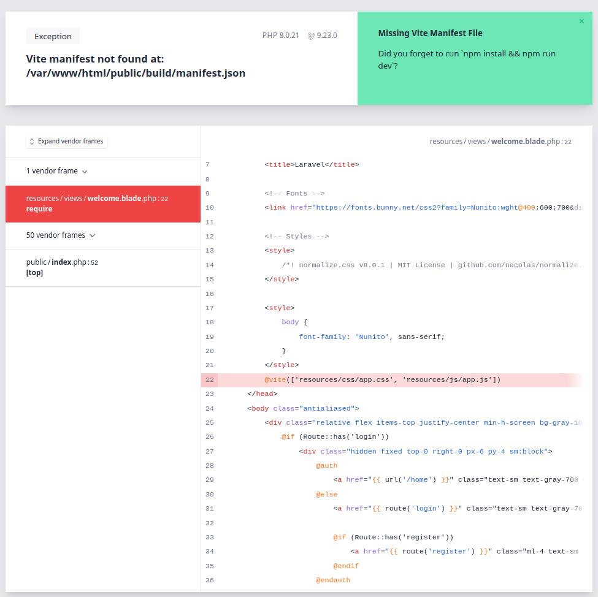

# Recreating this repo
## Create a default Laravel DDEV project
```
mkdir my-laravel-app
cd my-laravel-app
ddev config --project-type=laravel --docroot=public --create-docroot
ddev start
ddev composer create --prefer-dist laravel/laravel
ddev exec "cat .env.example | sed  -E 's/DB_(HOST|DATABASE|USERNAME|PASSWORD)=(.*)/DB_\1=db/g' > .env"
ddev exec 'sed -i "s#APP_URL=.*#APP_URL=${DDEV_PRIMARY_URL}#g" .env'
ddev exec "php artisan key:generate"
ddev launch
```


## Install the vite-serve add on
```
ddev get torenware/ddev-viteserve
ddev restart
ddev vite-serve start
```
now this is where it gets unclear to me, as far as I understand Laravel requires you to run npm run watch. This in turn runs the vite command, so it starts a vite dev server. If this is not running you get the following error:


## Import the entrypoints in laravel
According to [the Laravel vite documentation](https://laravel.com/docs/9.x/vite#loading-your-scripts-and-styles) this is done by adding
`@vite(['resources/css/app.css', 'resources/js/app.js'])` to the head of your `welcome.blade.php` file.

The problem is that laravel seems to always want to fetch the resources from localhost:
```
GET http://127.0.0.1:5174/@vite/client net::ERR_CONNECTION_REFUSED
GET http://127.0.0.1:5174/resources/css/app.css net::ERR_CONNECTION_REFUSED
GET http://127.0.0.1:5174/resources/js/app.js net::ERR_CONNECTION_REFUSED
```

### The million-dollar question
How does one get a boilerplate default laravel-vite project to run properly with DDEV, HMR enabled and all. Laravel is committing to vite, so it would be lovely if DDEV supported it (or at least have a guide on how to make it work).
